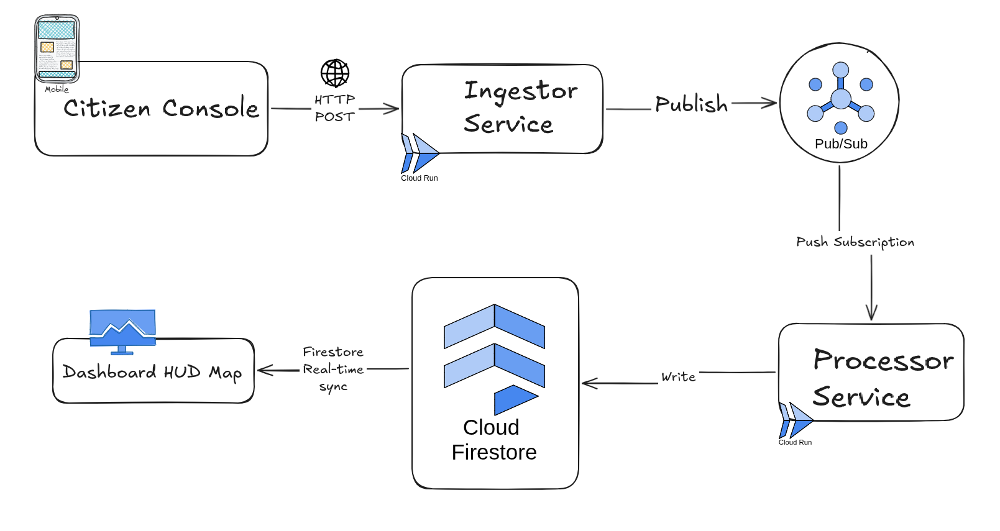

# S.E.N.S.E. (Signal Event & Notification Service Engine)

> **Today, I'm spiderman. I have no Stark Tech, no funding, and no fancy satellites. To fight crime, I rely on my Spidey S.E.N.S.E - 100% serverless, NoSQL, and scale-to-zero cloud-native infrastructure.**

---

## The Story

> Since Doctor Strange made the world forget my identity, I lost access to the Stark Industries network. No satellites, no AI assistants, no high-tech labs. I'm back to basics, broke, and paying rent in a cramped apartment.
> But crime doesn't stop. To track emergencies in real-time, I built **S.E.N.S.E.** using Google Cloud. The architecture is engineered around my core constraint as a street-level hero: **it must cost $0 when inactive (scale-to-zero) and scale instantly when multiple villains attack.**

---

## Cloud-Native Architecture & Communication Flow

S.E.N.S.E. splits ingestion from persistence using an asynchronous messaging topology. This ensures high throughput, zero message loss, and sub-millisecond real-time sync.



### 1. Ingestion Layer (`ingestor-service`)
* **Technology**: FastAPI running inside a serverless **Google Cloud Run** container.
* **Cost Constraints**: Scales to zero. If there are no alerts, the container shuts down and costs $0.
* **Role**: Exposes a secure `/tingle` endpoint protected by API key authorization. When a citizen triggers a panic alert, the Ingestor validates the payload and instantly hands it off to Pub/Sub.

### 2. Buffering & Queueing (`Google Pub/Sub`)
* **Technology**: Google Cloud Pub/Sub (fully managed message broker).
* **Cost Constraints**: I use the free tier (first 10GB/month is completely free).
* **Role**: Decouples the frontend ingestor from database writes. If multiple villains (e.g., Sinister Six) cause a surge of alerts, Pub/Sub buffers the messages to prevent database write bottlenecks.

### 3. Processing Layer (`processor-service`)
* **Technology**: FastAPI deployed to **Google Cloud Run** via a Pub/Sub push subscription.
* **Role**: When Pub/Sub receives a message, it makes an HTTP POST request to the Processor's `/pubsub` endpoint. The Processor container wakes up, parses the message, writes it to Firestore, and shuts down.

### 4. Real-Time Database (`Cloud Firestore`)
* **Technology**: Serverless NoSQL Document Database.
* **Role**: Stores distress coordinates inside the `tingles` collection. Because Firestore has native WebSocket support, the frontend dashboard can subscribe directly to collection updates, rendering markers on Spidey's map instantly without polling servers.

---

## Project Structure

```text
sense/
├── frontend/
│   ├── index.html            # Spider-Man Console interface (sends signals)
│   └── dashboard.html        # Map HUD Dashboard (displays active signals)
├── ingestor-service/
│   ├── main.py               # Ingress FastAPI service
│   ├── pubsub-init.py        # Local Pub/Sub emulator setup script
│   └── Dockerfile            # Python 3.14-slim container build
├── processor-service/
│   ├── main.py               # Firestore persistence FastAPI service
│   └── Dockerfile            # Python 3.14-slim container build
├── docker-compose.yml        # Orchestration for local emulated environment
└── README.md
```

---

## Local Development (Quick Start)

You can run the entire cloud-native stack locally using Docker Compose. This spins up the microservices alongside Google Cloud emulator containers so you can test the application offline for $0.

### Prerequisites
* **Docker & Docker Compose** installed.
* **Google Cloud SDK (gcloud CLI)** installed.
* **AGY (Antigravity CLI)** for autonomous deployment.
* **Google Maps API Key** (for rendering the dashboard map).

### 1. Spin up the Local Stack
Clone the repository and run Docker Compose at the project root:

```bash
git clone https://github.com/lxmwaniky/sense.git
cd sense
docker compose up -d
```

This starts 6 containers:
* **`sense-frontend`**: Serves the static HTML files on `http://localhost:8000` using Nginx Alpine.
* **`sense-ingestor-service`**: Listens on `http://localhost:8080`.
* **`sense-processor-service`**: Listens on `http://localhost:8081`.
* **`sense-pubsub-emulator`**: Simulates GCP Pub/Sub on `localhost:8085`.
* **`sense-firestore-emulator`**: Simulates Firestore on `localhost:8084`.
* **`sense-pubsub-init`**: One-off helper container that initializes the Pub/Sub topic and configures the push subscription to the Processor.

---

## Local Verification & Crime Fighting

1. Open the **Dashboard HUD Map** in your browser:  
   `http://localhost:8000/dashboard.html`
2. When prompted, enter your Google Maps API Key. (It is saved to your browser's local storage and is never hardcoded or pushed).
3. Open the **Console** in another browser window:  
   `http://localhost:8000/index.html`
4. Click the **Emergency** button. 
5. Watch the Console badge cycle through `ACQUIRING GPS...` $\rightarrow$ `BROADCASTING...` $\rightarrow$ `ONLINE`.
6. Inspect the Dashboard—a glowing distress beacon will render in real-time. If you trigger multiple alerts in the same area, the beacon will scale in size and pulse faster, indicating a high-crime intensity zone.

---

## Antigravity (AGY) Live Demo Guide

Follow these steps to demonstrate the **Antigravity (AGY)** autonomous agent capabilities during your live presentation. Each phase includes a copyable prompt optimized for the agent.

### Start AGY
Initialize the CLI in the project root folder:
```bash
agy
```

### Autonomous Codebase Analysis

**Prompt:**
```text
Hey AGY, analyze this codebase and explain the architecture of the project.

Context:
- The project is named S.E.N.S.E. (Signal Event & Notification Service Engine)
- It is a cloud-native monorepo containing multiple backend services and a static frontend.

Please:
1. Map out the folder structure and discover the FastAPI backend services.
2. Explain the communication topology between the components (how data flows from the frontend console to the database).
3. Verify the local environment configuration (Docker Compose, emulators) and confirm if everything is aligned for local testing.
```

---

### Local Verification & Browser Automation (Chrome DevTools + Scheduling)

**Prompt:**
```text
Let's spin up the local stack and verify the real-time event flow with docker compose up -d command.

Instructions:
1. Run the local application stack using `docker compose up -d`.
2. Use your Chrome DevTools MCP tools to launch two browser pages(setup the MCP Server if not available using this guide - https://developer.chrome.com/docs/devtools/agents/get-started:
   - Dashboard: http://localhost:8000/dashboard.html
   - Console: http://localhost:8000/index.html
3. The Dashboard will trigger a browser prompt asking for the Google Maps API Key.
   -> IMPORTANT: Do NOT ask me for this key in the chat. Instead, set a 10-second schedule timer or wait for 10 seconds to allow me to paste/type the key directly into the browser window.
4. Once the timer expires, simulate a click on the "Emergency" button on the Console page (index.html).
5. Verify that the Dashboard page (dashboard.html) dynamically receives the signal and updates the map with the pulsing beacon. Take a screenshot to confirm it worked!
```

---

### Production Deployment (Parallel Subagents & GCP Tools)

**Prompt:**
```text
Now that we've verified it locally, let's deploy the application live to Google Cloud.

Instructions:
1. Identify the active GCP Project ID (ask me if it is not configured).
2. Spawn 4 subagents in parallel to handle the deployment workloads:
   - Subagent A: Build and deploy `ingestor-service` to Google Cloud Run (ensure it scales to zero: min instances 0, maximum concurrency configured).
   - Subagent B: Build and deploy `processor-service` to Google Cloud Run (ensure it scales to zero: min instances 0).
   - Subagent C: Perform custom Firebase Hosting provisioning and deployment to target `spidey-sense.web.app`:
     a. Attempt to create the custom hosting site named `spidey-sense` using `npx firebase-tools hosting:sites:create spidey-sense --project <project-id>`.
     b. If `spidey-sense` is taken, try a unique fallback such as `spidey-sense-hud-[suffix]`.
     c. Apply a hosting deploy target alias using: `npx firebase-tools target:apply hosting spidey-sense-target <actual-site-id> --project <project-id>`.
     d. Modify `firebase.json`'s `"hosting"` configuration block to specify `"target": "spidey-sense-target"`.
     e. Retrieve the Firebase Web SDK credentials using `npx firebase-tools apps:sdkconfig`, inject them into `dashboard.html`.
     f. Deploy the static assets using: `npx firebase-tools deploy --only hosting:spidey-sense-target --project <project-id>`.
     g. Return the finalized live URL (e.g. `https://spidey-sense.web.app` or its fallback).
   - Subagent D: Create the live GCP Pub/Sub topic `emergency-beacons`. Once the topic is successfully created, Subagent D must coordinate with the other parallel subagents. As soon as Subagent B completes and returns the live `processor-service` URL, Subagent D will automatically establish the live GCP Pub/Sub push subscription pointing to that endpoint's `/pubsub` path. Finally, once all backend microservices are up, Subagent D will append and inject the newly generated production URLs into our application's configuration files (such as replacing the local endpoint in `index.html` with the live Cloud Run ingestor URL) so that the entire production system is fully integrated.
3. Output the live URLs of the services and confirm the production setup is operational.
```