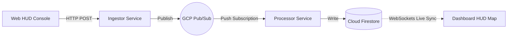

# S.E.N.S.E. (Signal Event & Notification Service Engine)

> **Today, I'm spiderman. I have no Stark Tech, no funding, and no fancy satellites. To fight crime, I rely on my Spidey S.E.N.S.E - 100% serverless, NoSQL, and scale-to-zero cloud-native infrastructure.**

---

## The Story

> Since Doctor Strange made the world forget my identity, I lost access to the Stark Industries network. No satellites, no AI assistants, no high-tech labs. I'm back to basics, broke, and paying rent in a cramped apartment.
> But crime doesn't stop. To track emergencies in real-time, I built **S.E.N.S.E.** using Google Cloud. The architecture is engineered around my core constraint as a street-level hero: **it must cost $0 when inactive (scale-to-zero) and scale instantly when multiple villains attack.**

---

## Cloud-Native Architecture & Communication Flow

S.E.N.S.E. splits ingestion from persistence using an asynchronous messaging topology. This ensures high throughput, zero message loss, and sub-millisecond real-time sync.



### 1. Ingestion Layer (`ingestor-service`)
* **Technology**: FastAPI running inside a serverless **Google Cloud Run** container.
* **Cost Constraints**: Scales to zero. If there are no alerts, the container shuts down and costs $0.
* **Role**: Exposes a secure `/tingle` endpoint protected by API key authorization. When a citizen triggers a panic alert, the Ingestor validates the payload and instantly hands it off to Pub/Sub.

### 2. Buffering & Queueing (`Google Pub/Sub`)
* **Technology**: Google Cloud Pub/Sub (fully managed message broker).
* **Cost Constraints**: I use the free tier (first 10GB/month is completely free).
* **Role**: Decouples the frontend ingestor from database writes. If multiple villains (e.g., Sinister Six) cause a surge of alerts, Pub/Sub buffers the messages to prevent database write bottlenecks.

### 3. Processing Layer (`processor-service`)
* **Technology**: FastAPI deployed to **Google Cloud Run** via a Pub/Sub push subscription.
* **Role**: When Pub/Sub receives a message, it makes an HTTP POST request to the Processor's `/pubsub` endpoint. The Processor container wakes up, parses the message, writes it to Firestore, and shuts down.

### 4. Real-Time Database (`Cloud Firestore`)
* **Technology**: Serverless NoSQL Document Database.
* **Role**: Stores distress coordinates inside the `tingles` collection. Because Firestore has native WebSocket support, the frontend dashboard can subscribe directly to collection updates, rendering markers on Spidey's map instantly without polling servers.

---

## Project Structure

```text
sense/
├── frontend/
│   ├── index.html            # Spider-Man Console interface (sends signals)
│   └── dashboard.html        # Map HUD Dashboard (displays active signals)
├── ingestor-service/
│   ├── main.py               # Ingress FastAPI service
│   ├── pubsub-init.py        # Local Pub/Sub emulator setup script
│   └── Dockerfile            # Python 3.14-slim container build
├── processor-service/
│   ├── main.py               # Firestore persistence FastAPI service
│   └── Dockerfile            # Python 3.14-slim container build
├── docker-compose.yml        # Orchestration for local emulated environment
└── README.md
```

---

## Local Development (Quick Start)

You can run the entire cloud-native stack locally using Docker Compose. This spins up the microservices alongside Google Cloud emulator containers so you can test the application offline for $0.

### Prerequisites
* **Docker & Docker Compose** installed.
* **AGY (Antigravity CLI)** for autonomous deployment.
* **Google Maps API Key** (for rendering the dashboard map).

### 1. Spin up the Local Stack
Clone the repository and run Docker Compose at the project root:

```bash
git clone https://github.com/lxmwaniky/sense.git
cd sense
docker compose up -d
```

This starts 6 containers:
* **`sense-frontend`**: Serves the static HTML files on `http://localhost:8000` using Nginx Alpine.
* **`sense-ingestor-service`**: Listens on `http://localhost:8080`.
* **`sense-processor-service`**: Listens on `http://localhost:8081`.
* **`sense-pubsub-emulator`**: Simulates GCP Pub/Sub on `localhost:8085`.
* **`sense-firestore-emulator`**: Simulates Firestore on `localhost:8084`.
* **`sense-pubsub-init`**: One-off helper container that initializes the Pub/Sub topic and configures the push subscription to the Processor.

---

## Local Verification & Crime Fighting

1. Open the **Dashboard HUD Map** in your browser:  
   `http://localhost:8000/dashboard.html`
2. When prompted, enter your Google Maps API Key. (It is saved to your browser's local storage and is never hardcoded or pushed).
3. Open the **Console** in another browser window:  
   `http://localhost:8000/index.html`
4. Click the **Emergency** button. 
5. Watch the Console badge cycle through `ACQUIRING GPS...` $\rightarrow$ `BROADCASTING...` $\rightarrow$ `ONLINE`.
6. Inspect the Dashboard—a glowing distress beacon will render in real-time. If you trigger multiple alerts in the same area, the beacon will scale in size and pulse faster, indicating a high-crime intensity zone.